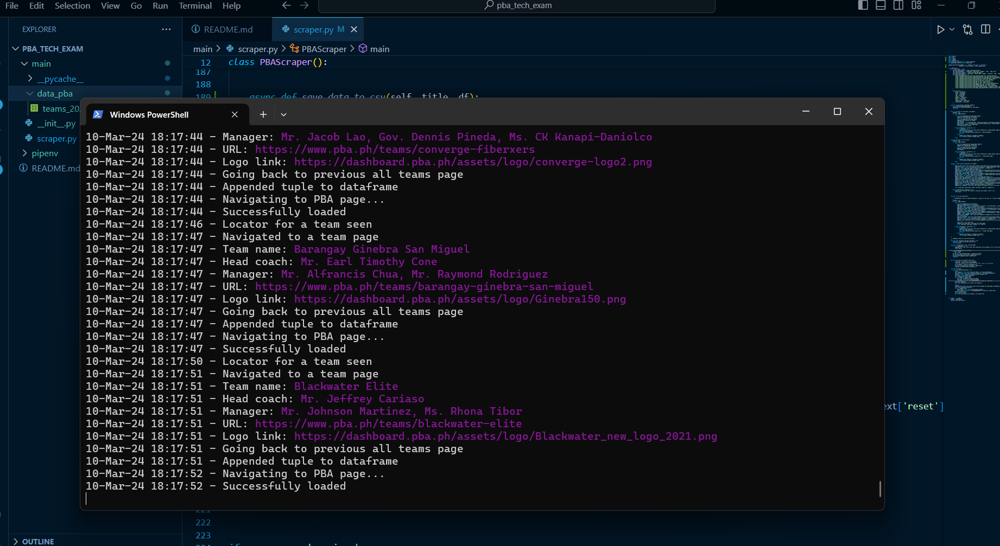
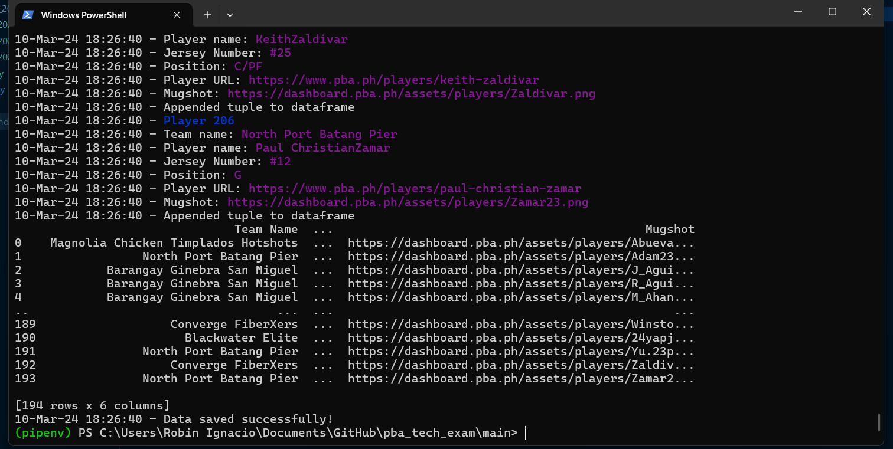
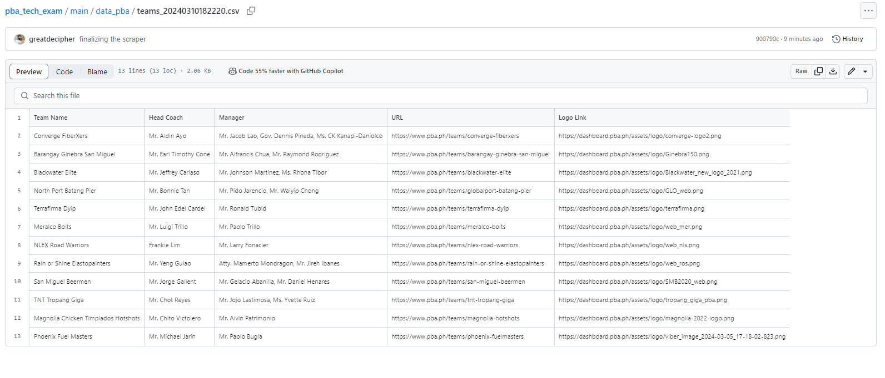
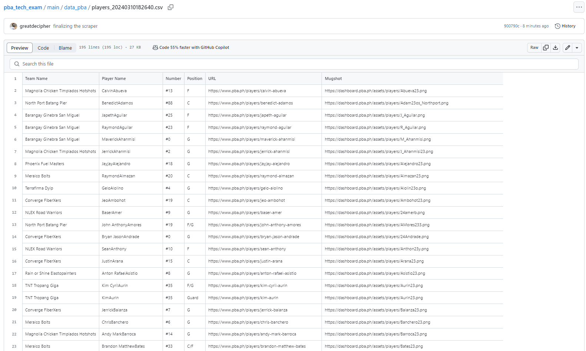

# PBA Scraper Using Playwright

## Description
This project serves as a technical examination of web scraping using Python 3.12. The developer implemented the Asynchronous Playwright package to extract data from the PBA Teams and Players pages.

Scraping these pages:
1. **Teams:** https://www.pba.ph/teams
2. **Players:** https://www.pba.ph/players
## Installation Steps
Follow these steps to set up and run the scraper:

1. **Clone Repository:**
   - Clone this repository to your local machine.

     ```bash
     git clone https://github.com/greatdecipher/pba_tech_exam.git
     ```

2. **Create Virtual Environment:**
   - Navigate to the 'main' folder and create a virtual environment.

     ```bash
     cd pba_tech_exam
     python -m venv venv
     ```

3. **Install Requirements:**
   - Install the required packages using pip.

     ```bash
     cd main/
     pip install -r requirements.txt
     ```

4. **Install Chromium Module:**
   - Run the following command to install the Chromium module.

     ```bash
     playwright install chromium
     ```

5. **Run the Scraper:**
   - Execute the scraper script.

     ```bash
     python -m scraper
     ```

## Logging
Logging is implemented on running the scraper, please see bash to trace scraper running in headless mode.

## Additional Concepts
1. **Headless mode** - scraper is running in the background with a visible browser.
2. **Playwright-Stealth** - Important module to counter scraper blockers/catpchas.

## Screenshots/Results

1. Scraping Teams data
   

2. Total Players scraping in Bulk
   

3. Result of Teams
   

4. Result of Players
   

## Notes
- Ensure you have Python 3.12 installed on your machine before proceeding with the installation steps.

